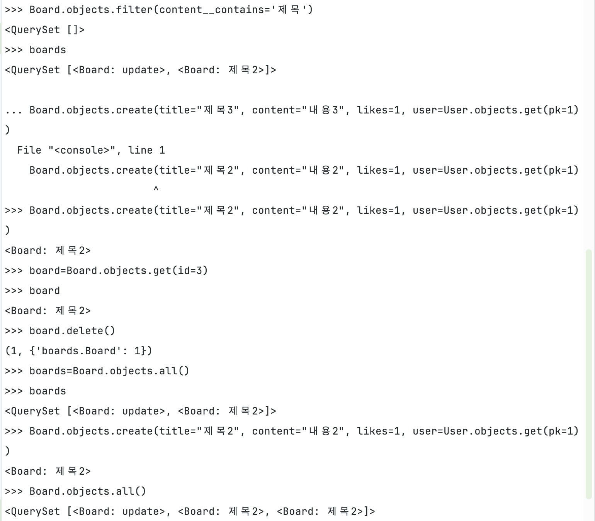

# Day_1
### - Django
Python 기반의 웹 프레임워크로, 고수준의 웹 개발을 위한 기능을 포괄적으로 제공

대표적인 모듈로는 ORM(객체 관계 매핑), MTV(Model-Template-View) 아키텍처, Django REST framework(RESTful API 개발) 등

### - Poetry 세팅
```sql
// 초기화, pyproject.toml파일 생성
poetry init

// .venv와 poetry.lock파일이 생김 ( 가상환경설정과 Django설정 )
poetry add Django
```
- **pyproject.toml ( 구조와 의존성 정의 )**
    
    프로젝트 이름, 버전, 저자, 의존성 등 프로젝트에 대한 기본 설정과 정보를 포함
    
- **poetry.lock ( 의존성의 구체적 버전 )**
    
    프로젝트에서 사용하는 모든 패키지와 그 의존성의 구체적인 버전을 포함
    
    프로젝트를 다른 환경에서 재생성할 때 동일한 의존성을 보장

### - 마이그레이션
→ DB의 모양을 변형시키는 파이썬 코드가 있는 파일<Br>
→ 적용할 때 유를 변형시키고 필요한 기본테이블을 갖게 됨 ( db.sqlite3파일 확인 )

### - django-admin vs python manage.py

**django-admin runserver** 명령어를 사용하면 Django 개발 서버가 시작되지만,
프로젝트의 데이터베이스 설정이나 다른 설정이 반영 X<br>
**python manage.py runserver**를 사용하면 개발 서버가 시작되면서
**settings.py**에 정의된 프로젝트 설정이 모두 적용

→ 개발자들은 프로젝트 관련 작업을 할 때 **manage.py**를 사용하는 것을 선호
# Day_2
### - URL Dispatcher

Django 웹 프레임워크의 핵심 구성 요소 중 하나로,
웹 요청을 처리하고 해당 요청에 맞는 View 함수로 라우팅하는 역할

  *  Dispatcher : 일반적으로 어떤 요청이나 정보를 받아 적절한 목적지 또는 처리 절차로 
                            전달하는 역할을 하는   컴포넌트를 지칭하는데 사용

### - Model
웹 애플리케이션의 데이터 구조를 정의하고 데이터베이스와의 상호작용을 관리하는 중요한 부분

ORM (Object-Relational Mapping) 시스템의 핵심

SQL 쿼리 없이 데이터베이스를 간편하게 조작

# Day_3
### - Admin Pannel

Django의 관리자 인터페이스(Admin Interface)는 Django의 강력한 기능 중 하나로, 웹 애플리케이션의 데이터를 관리하기 위한 사용자 친화적인 인터페이스를 제공

→ Django는 http://127.0.0.1:8000/admin 자동구현

### - Custom Admin ( 상속을 이용한 클래스 )
### - Common Model ( 추상 기반 클래스 )

추상 기반 클래스는 데이터베이스에 직접적으로 매핑되어 테이블을 생성하지 않는 대신,
상속받은 다른 모델들이 `CommonModel`의 필드와 메소드를 사용(created_at, updated_at)

이 방식은 코드 중복을 피하고, 여러 모델에 걸쳐 공통적인 필드를 일관되게 유지하는 데 유용


# Day_4
### - ORM
Object-Relational Mapping = 객체-관계형데이터베이스 연결시키는것<br>
→ DB의 데이터를 객체처럼 사용할 수 있도록 함

- Model은 DB 테이블 생성을 해주는 역할
- ORM은 DB 테이블 데이터를 읽어주는 역할

### - QuerySet
Django의 QuerySet은 데이터베이스로부터 쿼리를 생성하고 실행하는 강력한 도구<br>
QuerySet은 데이터베이스의 테이블로부터 객체 집합<br>
→ 여러 가지 방식으로 이 집합을 조작하고 필터링이 가능
### QuerySet 특징

1. 지연된 실행 : 실제 DB조회를 연산이나 반복할 때까지 지연하여 성능 최적화에 도움
2. 메소드 체이닝 : 여러 QuerySet메소드들을 연결하여 하나의 쿼리 문장을 구성
→ 코드의 가독성과 효율성 향상
3. 캐싱 : 결과를 캐시하여 동일 QuerySet을 사용하면 DB에 쿼리요청하지 않음
4. 슬라이싱 : 쿼리 결과의 특정 부분을 쉽게 추출
5. 복잡한 쿼리 : Q 객체의 사용으로 복잡한 쿼리 조건 구성 / F 객체로 필드 간의 관계나 조건을 표현
6. 데이터베이스 최적화 : **`select_related()`**와 **`prefetch_related()`** 메소드를 사용하여 데이터베이스 쿼리의 수를 줄이고 성능을 최적화할
**`select_related()` :**  외래키 관계를 따라 데이터베이스 조인을 사용하여 관련 객체를 한 번의 쿼리
**`prefetch_related()`** : 별도의 쿼리를 실행하여 관련 객체를 미리 가져옴
→ select_related()는 관련 객체가 하나일 때, prefetch_related()는 관련 객체가 여러개일 때 유리


